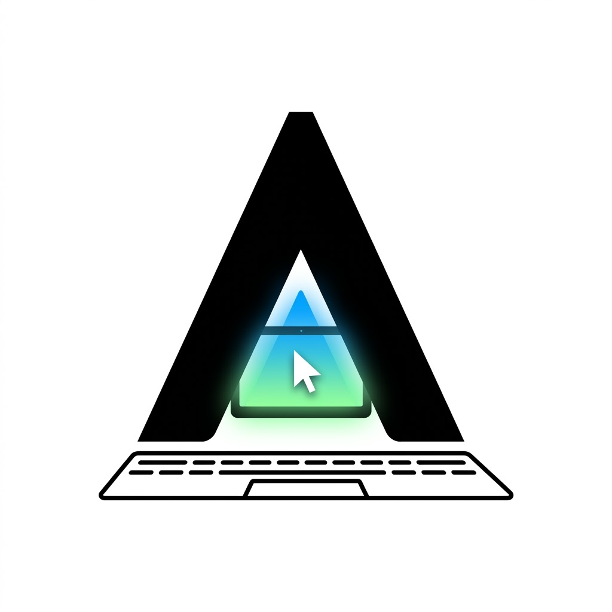

<div align="center">



# Accio Computer Use

**Hybrid computer use for AI agents.**

GUI actions, CLIs, APIs, and files—combined in one Python block.

[](LICENSE)
[](VERSION)

[Quick start](#quick-start) · [Security](#security) · [Results](#macosworld-results) · [Citation](#citation) · [Contributing](CONTRIBUTING.md)

</div>

---

Accio brings macOS interaction into normal Python, so an agent can use the GUI only where the GUI is needed and combine it with shell commands, app CLIs, APIs, and files in the same task.

- **Hybrid by default.** Desktop actions and ordinary code share one execution block, including imports, conditions, loops, parsing, and local tools.
- **Fewer model round trips.** A block can complete dependent steps, branch on returned state, and recover locally instead of asking the model to plan every click separately.
- **Observable and verifiable.** GUI actions return refreshed accessibility state and screenshot artifacts; typed Python signatures catch invalid calls before they reach the desktop.
- **Reusable after success.** Code written for one task can be kept as a function or workflow instead of remaining an unstructured action trace.

## Quick start

Accio currently supports macOS 14 or later. You will need Swift 6,
Python 3.10 or later, Accessibility permission, and Screen Recording permission.

Version 0.0.1 is a source-only release. Build and install it locally using the
scripts below; the project does not currently distribute a prebuilt,
notarized application.

### Install and authorize

From the repository root, run:

```bash
git clone https://github.com/Accio-Work-Lab/accio-cu.git
cd accio-cu
./scripts/install-macos.sh --verify --install-skill
```

This single command builds and signs the app, installs the CLI and skill, opens
the two required macOS permission panes, waits for both grants, installs the
background daemon, and verifies the installed runner. Enable **Accessibility**
and **Screen Recording** for **Accio Computer Use** when prompted; the terminal
continues automatically.

If permission setup is interrupted or macOS asks the app to quit, resume
without rebuilding:

```bash
./scripts/install-macos.sh --continue-install
```

To install the skill for Claude Code instead:

```bash
./scripts/install-macos.sh --install-skill claude
```

The installer creates a project-specific local code-signing identity in the
current user's login keychain on first use and reuses it for later builds. The
first migration from an older ad-hoc build requires one permission refresh;
subsequent rebuilds preserve the macOS TCC identity. To use an existing Apple
or local certificate instead:

```bash
ACCIO_CODESIGN_IDENTITY="Developer ID Application: Example (TEAMID)" \
  ./scripts/install-macos.sh --verify --install-skill
```

Ad-hoc signing is available only when explicitly requested for CI or temporary
package checks:

```bash
./scripts/install-macos.sh --signing-mode adhoc --no-onboarding --verify
```

To remove the app, daemon, CLI link, and Accio's scoped TCC grants:

```bash
./scripts/install-macos.sh --uninstall
```

For CI or package-only builds, `--no-onboarding` skips permission UI and daemon
installation. Normal desktop installations should not use it.

Restart your agent, then give it a desktop task:

```text
Open Finder, create a folder named Research Notes in Documents,
move the three PDF files into it, and verify the final folder contents.
```

The installed skill handles observation, interaction, and final verification.

### Update an existing installation

After pulling the latest changes, rebuild, replace the app, restart its daemon,
and verify everything with the same command:

```bash
./scripts/install-macos.sh --verify --install-skill
```

The first migration from an older ad-hoc build asks for the two permissions
once. Later builds signed by the persistent local identity retain them.

## One block, many tools

Pipe Python into `accio-computer-use`; the desktop functions are already loaded:

```bash
accio-computer-use <<'PY'
from pathlib import Path

def create_note(source_file):
    body = Path(source_file).expanduser().read_text()

    click(app="Notes", element_text="New Note")
    type_text(app="Notes", text=body)

    final = get_app_state(app="Notes")
    return {
        "saved": body[:40] in final.text,
        "screenshots": final.screenshot_paths,
    }

emit(create_note("~/Documents/research-notes.md"))
PY
```

This block reads a file, applies Python logic, and operates a native app. The same block could call an app CLI or API before using the GUI. A model can write it while solving the task, then keep the working code for the next run.

For execution limits or a custom daemon socket, use the explicit `code` subcommand:

```bash
accio-computer-use code --timeout 60 --max-calls 30 < workflow.py
```

## MCP

The same coding runtime is available as one MCP tool named `execute`:

```json
{
  "mcpServers": {
    "accio-computer-use": {
      "command": "accio-computer-use",
      "args": ["code", "mcp", "--timeout", "60", "--max-calls", "30"]
    }
  }
}
```

The tool accepts a Python program and returns its output, desktop calls, and screenshot artifacts. Limits are fixed when the MCP server starts.

This hybrid MCP is started with `code mcp`. The separate `accio-computer-use mcp` command is the lower-level interface that exposes individual desktop actions instead of the single `execute` tool.

Coding MCP is intentionally opt-in. It executes normal Python with the current
user's permissions and must be enabled only for trusted clients and code.

## MacOSWorld results

Completed runs and planned comparisons:

| Agent | Computer-use interface | Model | Status | Success rate | Tokens | Time |
| --- | --- | --- | --- | ---: | ---: | ---: |
| Accio | Legacy Accio CLI | GPT-5.4 | Complete | 58.42% (118/202) | 144.64M | 11h 52m |
| **Accio** | **Accio hybrid (Python blocks)** | **GPT-5.5** | **Complete** | **64.85% (131/202)** | **82.16M** | **5h 31m** |
| Codex | Codex Computer Use | GPT-5.5 | Complete | 62.38% (126/202) | — | 9h 55m |
| Codex | Accio hybrid | TBD | Planned | — | — | — |
| Claude Code | Accio hybrid | TBD | Planned | — | — | — |
| Gemini CLI | Accio hybrid | TBD | Planned | — | — | — |
| Controlled ablation | Accio CLI ↔ Accio hybrid | Same model | Planned | — | — | — |

Across all 202 non-safety [MacOSWorld](https://github.com/showlab/macosworld) tasks, Accio hybrid improved on the legacy run by **6.43 points**, with **43.2% fewer recorded tokens** and **53.5% less recorded time**. Only a score of 100 counts as success; because the runs used different model versions, this is an end-to-end comparison rather than a controlled harness ablation.

## Current limits

- macOS 14 or later only
- Accessibility and Screen Recording permissions are required
- Some Electron and non-native apps may briefly become frontmost during an input fallback
- Some background input routes use private SkyLight APIs and may need updates after macOS changes
- coding mode runs normal Python with the caller's filesystem, environment, network, and user-session access; it is not a sandbox

Use an isolated VM or dedicated macOS session for untrusted agents and large rollout workloads.

## Security

Accio is a local, high-privilege automation tool:

- the daemon socket uses the current macOS user as its trust boundary;
- screenshots, accessibility state, logs, and traces may contain private data;
- coding mode is unsandboxed and can access the current user's files,
  environment, network, and processes;
- SkyLight integration uses unsupported Apple private APIs and is not intended
  for Mac App Store distribution.

Do not expose the daemon or MCP transports to a network. Use a dedicated macOS
account or VM for untrusted agents. See [SECURITY.md](SECURITY.md) for reporting
and deployment guidance.

## Development

```bash
swift build
swift test
swift build -c release --product AccioComputerUse
python3 -m unittest discover -s coding/tests -p 'test_*.py'
bash -n scripts/install-macos.sh
bash -n scripts/install-daemon.sh
```

See [CONTRIBUTING.md](CONTRIBUTING.md) for contribution and platform-testing
requirements.

## Authors

Tianyuan Yang<sup>\*</sup>, Yu Gu<sup>\*</sup>, Lanbo Lin, Yuanwu Xu, Li Cai,
and Sicong Xie

<sup>\*</sup> Equal contribution.

## Citation

If you use Accio Computer Use in your work, please cite this repository:

```bibtex
@misc{Yang2026Accio,
    author={Tianyuan Yang and Yu Gu and Lanbo Lin and Yuanwu Xu and Li Cai and Sicong Xie},
    title={Accio Computer Use},
    note={GitHub repository},
    howpublished={\url{https://github.com/Accio-Work-Lab/accio-cu}},
    year={2026}
}
```

## License

Accio Computer Use is licensed under the
[Apache License 2.0](LICENSE). Attribution information is in [NOTICE](NOTICE).
